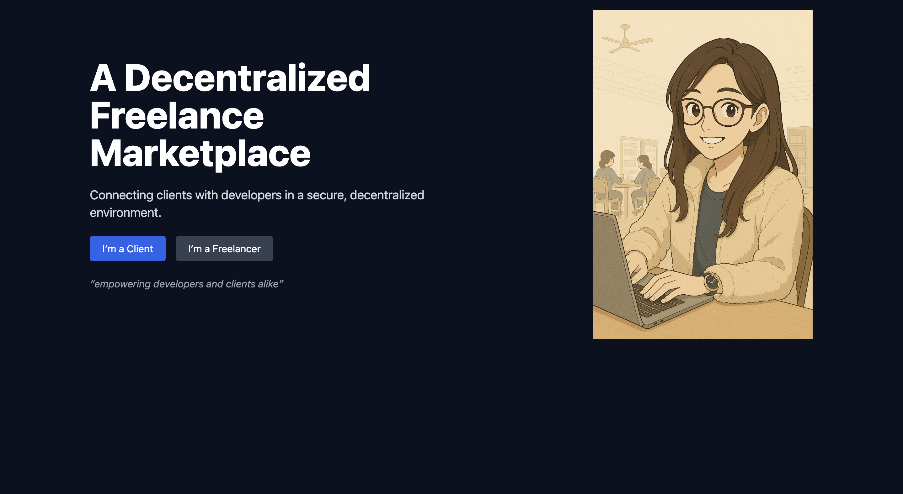
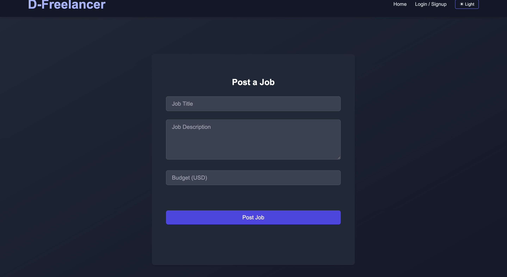
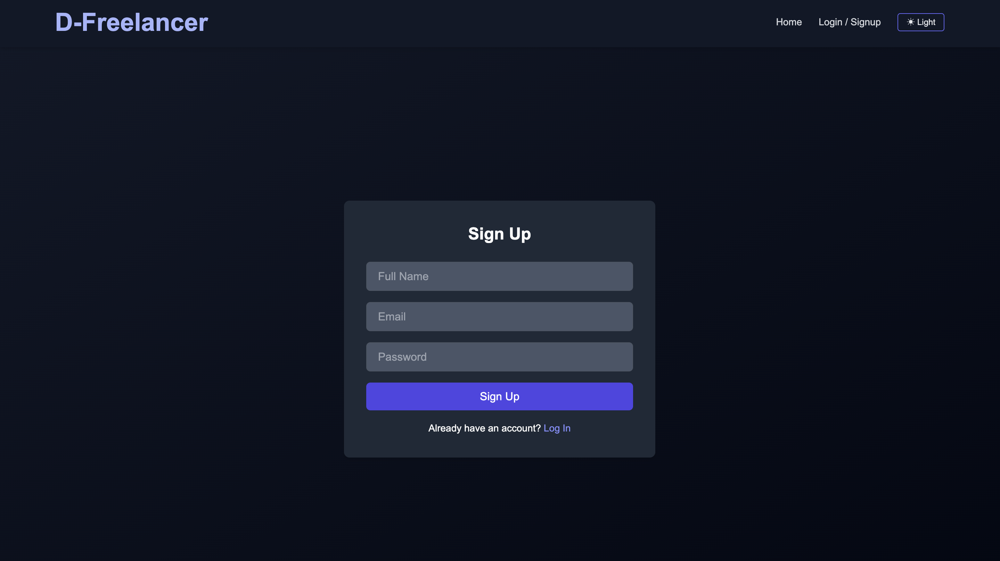
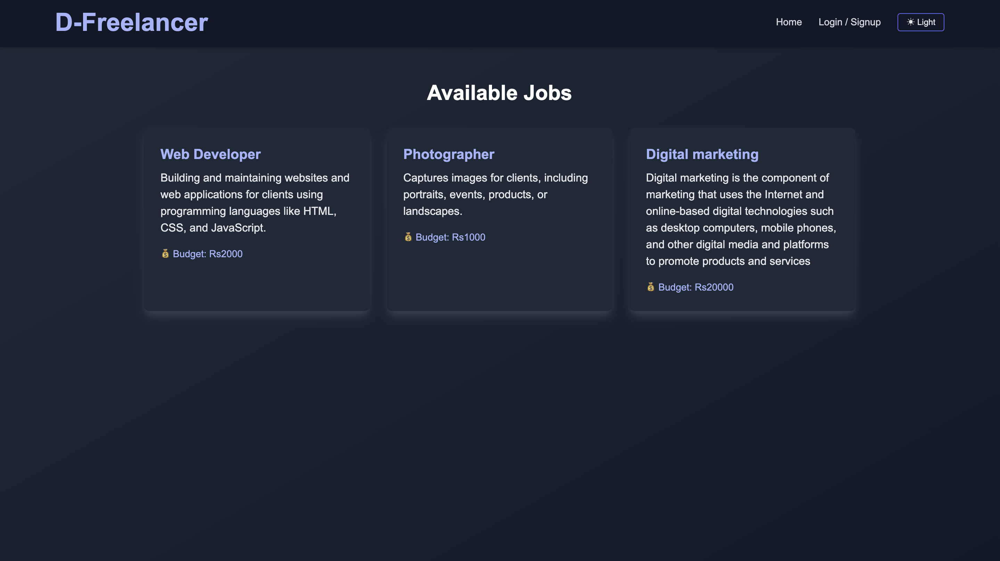

# D-Freelancer 💼✨

A fully functional decentralized freelance marketplace that connects clients with developers in a secure, blockchain-inspired environment.

## 🔗 Live Demo

Frontend: [d-freelance.vercel.app](https://d-freelance.vercel.app)  
Backend: Hosted on Supabase (private APIs)

---

## 🛠️ Tech Stack

- **Frontend**: React, Tailwind CSS (CDN)
- **Backend**: Node.js, Express.js
- **Database**: PostgreSQL (via Supabase)
- **Authentication**: Supabase Auth
- **Hosting**: Vercel (Frontend), Supabase (Backend + DB)

---

## ✨ Features

- 🔐 User Authentication (Sign Up / Login)
- 🧑‍💼 Role-based Access (Client & Freelancer)
- 📌 Post Jobs (Client Dashboard)
- 📋 View Available Jobs (Freelancer Dashboard)
- 🌙 Dark/Light Mode Toggle
- 💡 Clean UI with Responsive Design

---

## 📸 Screenshots

### 🚀 Landing Page

### 📝 Post a Job

### 🧾 Sign Up

### 🔍 Available Jobs

---

## 📁 Folder Structure

client/ # React frontend
├── components/ # Reusable UI components
├── pages/ # Routes
└── ...

server/ # Express backend
├── routes/ # API endpoints
├── controllers/ # Request logic

---

## 🧪 How to Run Locally

### Frontend

cd client
npm install
npm start

Backend

cd server
npm install
node index.js

🙋‍♀️ Developed By
Ruchi Dewangan
3rd-year IT student, NIT Raipur
🚀 Passionate about full-stack development, UI/UX, and Web3.

📬 Contribute
If you'd like to contribute, fork this repo and submit a pull request. Feedback and suggestions are welcome!

📜 License
This project is licensed under the MIT License.
